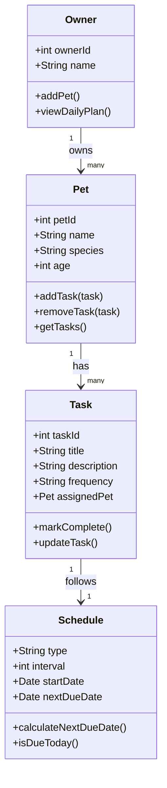

# PawPal Class Diagram

```mermaid
classDiagram
    class Pet {
        +int petId
        +String name
        +String species
        +int age
        +addTask(task)
        +removeTask(task)
        +getTasks()
    }

    class Task {
        +int taskId
        +String title
        +String description
        +String frequency
        +Pet assignedPet
        +markComplete()
        +updateTask()
    }

    class Schedule {
        +String type
        +int interval
        +Date startDate
        +Date nextDueDate
        +calculateNextDueDate()
        +isDueToday()
    }

    class Owner {
        +int ownerId
        +String name
        +addPet()
        +viewDailyPlan()
    }

    Owner "1" --> "many" Pet : owns
    Pet "1" --> "many" Task : has
    Task "1" --> "1" Schedule : follows
```
