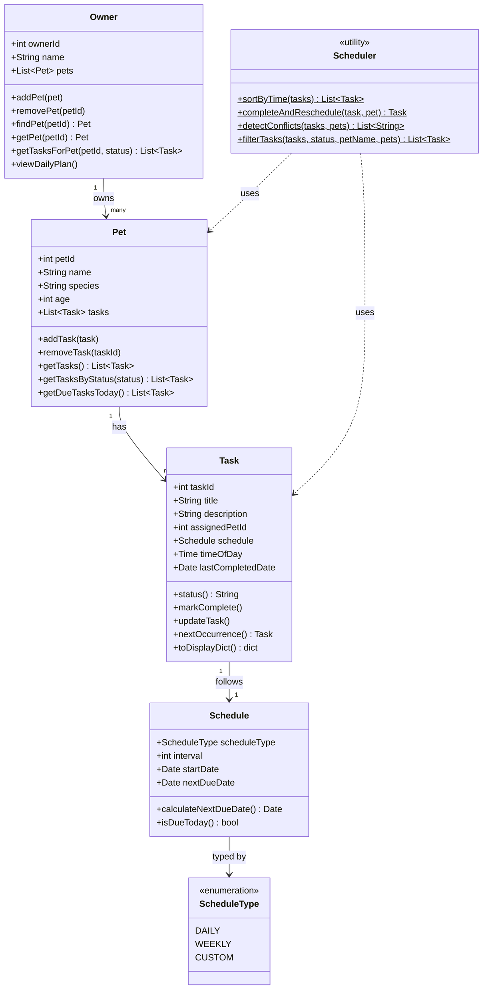

# PawPal Class Diagram



```
https://mermaid.ai/play?utm_source=mermaid_live_editor&utm_medium=share#pako:eNqNVW1P2zAQ_iuRtQ8gStX0BdoIVQLCJDRG0eg0beoXE1-LhWNXtgNkqPz2nZOmddKCFqlq7p7nfL7H58sbSRQDEpFEUGNiTheapjMZ4FN4gvvkEVgmYJovIXgrEfecnYHMUtDUciXH4y0Qn1_f_N6av66uvvn25c_76eR7aa9mcl8qP81RLb_xDI_DpQ3wB_qZCs8dU4shlmrr3pqAhFcbZ9CAEiqSTKDvdgsfHAYNFjcITRWjOWIPSom99UypearV4vZp0XnN_AKt5nIRWG4F7LoZmETzpRO5sRBm4AsJ7A5sfb1KxUosD5vyFDBTCpN5TPOmIrhpe6nSpQALrFExymgzg9WW-_KQlOqnKurg0AOyJcM1nAg1t9N9kiSZ1iATp61jeLhVMTdLQfOYJxZhhn975cXCd9RdNsUoVZQ03aOtWULCwTR1XfjUG27su9vhe3FyPpkyVhTn_H6BGlL1DBvomvngAqxDnJLbpffgF_l9qXgp_Mds14guoOrGJq8h2uRFgt6RTTnvfwhXLI66vzuhG1qg-wC9u0qsgboOcy7ZFnBnWS_rM6yo96vSG04r-FSlZw4vMeUivxNUVr34wezR9RmXWS64zf35dmSUthe5u0rF-dayfvFHyfpSnEv2A6rLWIS0nHxl4_sBDMkJ3kA5F9jzply94FY5ylOpZZlzgYOv7Kl1QClGEXiL51dbwd_lRoKyKWYknJHg-HiMbymVORruikWuO9Zn7ew9tGLQRcEjXdMK2-e5t81cioK5EkK9rMkbv6PWpn0UWPxjwUNeZ-qg3R5XSTMDZh9cbt2hpEUWmjMSWZ1Bi-A3K6XOJMVJz4h9BGxyEuErw1k2IzO5wpgllX-USqswrbLFI4nmVBi0ytm2_lxuKCAZ6EuVSUui0aBYgkRv5JVE3UG33Tvphf3eqNsZjob9fovkJOq0e73RAJ9eeNrvhMPhyapF_hZZw3YnPB0MumEPwX43PD1Z_QOdwFEd
```