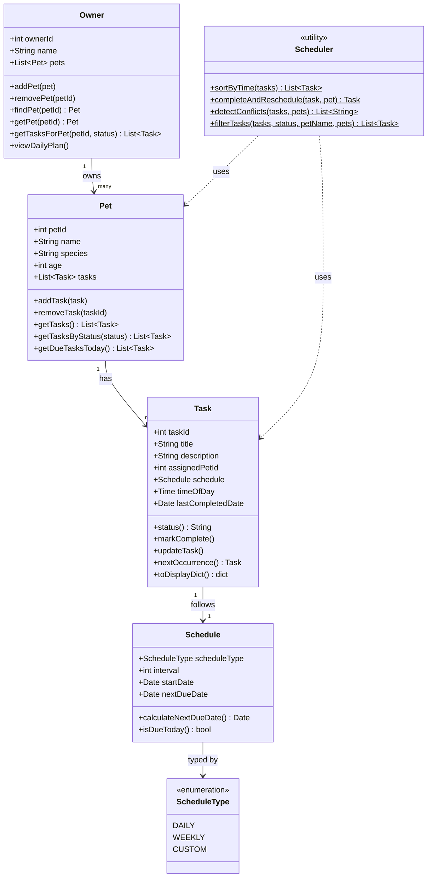

# PawPal Class Diagram

```mermaid
classDiagram
    class ScheduleType {
        <<enumeration>>
        DAILY
        WEEKLY
        CUSTOM
    }

    class Schedule {
        +ScheduleType scheduleType
        +int interval
        +Date startDate
        +Date nextDueDate
        +calculateNextDueDate() Date
        +isDueToday() bool
    }

    class Task {
        +int taskId
        +String title
        +String description
        +int assignedPetId
        +Schedule schedule
        +Time timeOfDay
        +Date lastCompletedDate
        +status() String
        +markComplete()
        +updateTask()
        +nextOccurrence() Task
        +toDisplayDict() dict
    }

    class Pet {
        +int petId
        +String name
        +String species
        +int age
        +List~Task~ tasks
        +addTask(task)
        +removeTask(taskId)
        +getTasks() List~Task~
        +getTasksByStatus(status) List~Task~
        +getDueTasksToday() List~Task~
    }

    class Owner {
        +int ownerId
        +String name
        +List~Pet~ pets
        +addPet(pet)
        +removePet(petId)
        +findPet(petId) Pet
        +getPet(petId) Pet
        +getTasksForPet(petId, status) List~Task~
        +viewDailyPlan()
    }

    class Scheduler {
        <<utility>>
        +sortByTime(tasks) List~Task~$
        +completeAndReschedule(task, pet) Task$
        +detectConflicts(tasks, pets) List~String~$
        +filterTasks(tasks, status, petName, pets) List~Task~$
    }

    Owner "1" --> "many" Pet : owns
    Pet "1" --> "many" Task : has
    Task "1" --> "1" Schedule : follows
    Schedule --> ScheduleType : typed by
    Scheduler ..> Task : uses
    Scheduler ..> Pet : uses
```